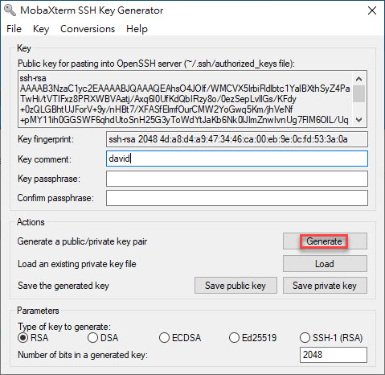
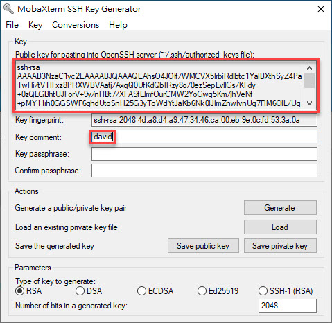
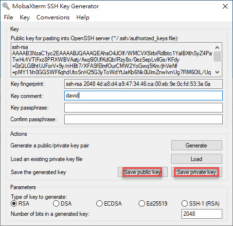
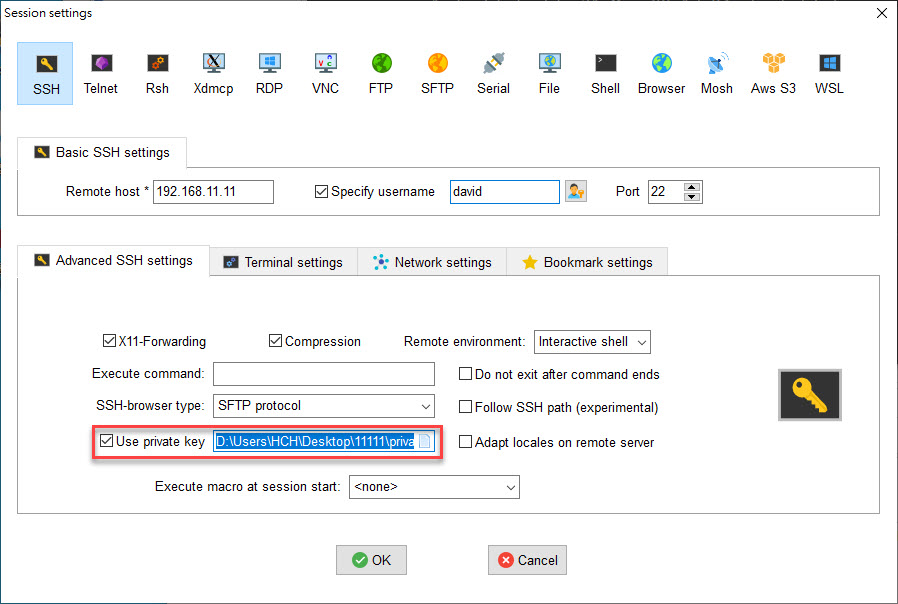
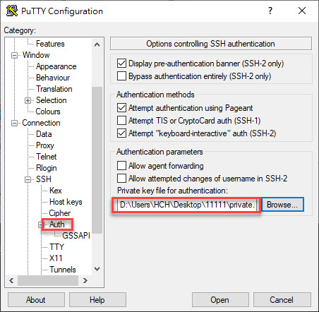
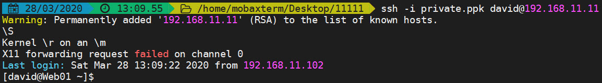
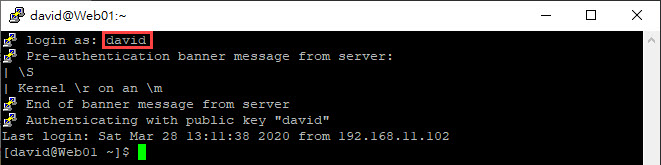

# SSH相關配置

```
vi /etc/ssh/sshd_config
```

- Port 22			###預設sshd監聽的端口，建議更改成五位以上的陌生端口號
- Protocol 2       ###SSH協議版本號，SSH1有缺陷跟漏洞
- ListenAddress 0.0.0.0      ###設置sshd服務器綁定的IP地址
- HostKey /etc/ssh/ssh_host_rsa_key      ###設置服務器密鑰文件的路徑
- KeyRegenerationInterval 3600     ###每隔多久時間重新建立一次，以秒為單位，SSH1會使用Server的Public Key
- ServerKeyBits 1024     ###服務器密鑰的長度
- SyslogFacility AUTHPRIV     ###記錄來自sshd的消息時，是否給出"facility code"
- LogLevel INFO     ###用來記錄sshd日誌消息的級別
- LoginGraceTime 2m     ###用來設置如果用戶登錄失敗，在切斷連接前服務器需等待的時間，以秒為單位
- PermitRootLogin yes     ###設置root用戶能否用ssh登錄，建議為no
- StrictModes yes     ###用來設置ssh在接收登錄請求前是否檢查用戶根目錄和rhosts文件的權限和所有權，建議為yes
- RSAAuthentication no     ###是否開啟RSA密鑰驗證，只針對SSH1，如採用RSA密鑰方式登入時，開啟此選項
- PubkeyAuthentication yes     ###用來設置是否開啟公鑰驗證
- AuthorizedKeysFile      .ssh/authorized_keys     ###用來設置公鑰驗證文件的路徑，與PubkeyAuthentication配合使用
- IgnoreUserKnownHosts no     ###用來設置SSH在進行RhostsRSAAuthentication安全驗證時是否忽略用        戶"$HOME/.ssh/known_hosts"文件
- IgnoreRhosts yes     ###用來設置驗證時是否使用"~/.rhosts"和"~/.shosts"文件
- PasswordAuthentication yes     ###用來設置是否開啟密碼驗證
- PermitEmptyPassword no     ###用來設置是否允許用口令為空的帳號登錄系統
- ChallengeResponseAuthentication no     ###禁用s/key密碼
- UsePAM yes     ###通過PAM驗證
- X11Forwarding yes     ###用來設置是否允許X11轉發
- PrintMotd yes     ###用來設置是否用戶登錄時顯示"/etc/motd"中的信息，可加入警告信息
- PrintLastLog yes     ###是否顯示上次登錄信息
- Compression yes     ###是否開啟壓縮命令
- TCPKeepAlive yes     ###防止死連接
- UseDNS yes     ###使否使用DNS反向解析
- MaxStartups 5     ###設置同時允許幾個尚未登錄的聯機，當用戶連上ssh時尚未輸入密碼稱為聯機
- MaxAuthTries 3     ###設置最大失敗嘗試登錄次數為3
- AllowUser (用戶名)     ###指定允許通過遠程訪問的用戶，多用戶以空格分隔
- AllowGroups (群組名稱)     ###指定允許通過遠程訪問的群組，多群組以空格分隔
- DenyUser (用戶名)     ###指定禁止通過遠程訪問的用戶，多用戶以空格分隔
- DenyGroups (群組名稱)     ###指定禁止通過遠程訪問的群組，多群組以空格分隔

# 目前所使用的方式

- 使用Putty KeyGen，建立SSH Key，點選Generate



- 複製Key值及輸入key comment，對應用戶名



- 登錄系統創建使用者帳號及密碼

```
useradd david
passwd david
```

- 切換到david的帳號，在david家目錄裡，創建 .ssh的資料夾及在.ssh中創建authorized_keys文件

```
mkdir .ssh
cd .ssh
vi authorized_keys
```

- 將上述所複製的Key值，貼到authorized_keys文件中

  

- 調整 .ssh目錄權限為700

```
chmod 700 .ssh
```

- 調整authorized_keys文件權限為600

```
chmod 600 authorized_keys
```

- 修改ssh_config文件

```
PubkeyAuthentication yes
PasswordAuthentication no
```

- 重啟sshd服務

```
systemctl restart sshd
```


- 將Public Key & Private Key保存下來



- 開啟MobaXterm，使用圖形介面的方式匯入Key認證進行登錄



- 開啟MobaXterm，使用命令的方式進行Key認證進行登錄

```
ssh -i private.ppk david@192.168.11.11			###需指定private.ppk的路徑
```

- 使用putty登錄



- 登錄驗證







